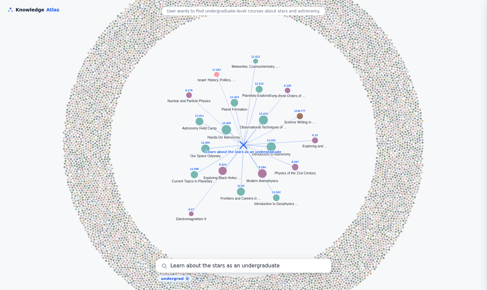
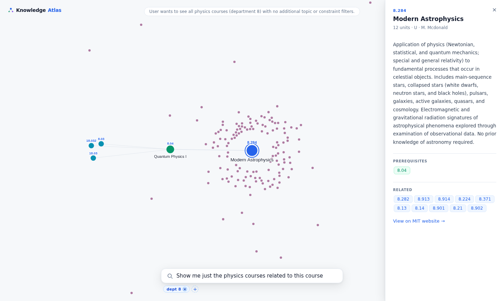

# ConceptAtlas

AI-powered learning discovery engine. Type a learning goal, and ConceptAtlas surfaces relevant MIT courses, expands prerequisite chains, and organises everything into an interactive force-directed graph.

Data source: MIT course catalog via the [FireRoad API](https://fireroad.mit.edu/reference/catalog) (~7,083 courses).

## Screenshots

**Natural language search with automatic filter extraction**
Type a learning goal in plain English — the LLM extracts semantic topics and hard constraints simultaneously. Here, "Learn about the stars as an undergraduate" produces an astronomy-focused radial view with an `undergrad ×` filter chip applied automatically.



**Filtering within a focused course view**
Click any course to centre it with its full prerequisite graph and similarity rings. Subsequent queries refine rather than reset — here, "Show me just the physics courses related to this course" adds a `dept 8 ×` chip while keeping Modern Astrophysics (8.284) as the focal node.



## How it works

1. **Input** — free-form learning goal ("I want to learn robotics")
2. **Intent extraction** — Claude (`claude-haiku-4-5`) parses the query into structured intent: topics to search for, hard filters (level, department, units, instructor), and a one-sentence explanation for display
3. **Semantic search** — each extracted topic is embedded with `all-MiniLM-L6-v2` and matched against course embeddings; results are merged by rank
4. **Visualisation** — courses rendered as a force-directed galaxy; search results radiate from centre; clicking a course centres it with its full prereq chain and similarity-based background clustering

## Stack

| Layer        | Tool                                        |
|--------------|---------------------------------------------|
| LLM          | Claude `claude-haiku-4-5` (Anthropic)       |
| Embeddings   | `sentence-transformers` `all-MiniLM-L6-v2`  |
| Vector DB    | ChromaDB                                    |
| API          | FastAPI                                     |
| Frontend     | D3 v7 force simulation on HTML5 Canvas      |
| Data         | MIT via FireRoad API                        |

## Project structure

```
ConceptNavigator/
├── ingest/
│   ├── fetch_mit.py       # Pulls all courses from FireRoad API → data/courses_raw.json
│   ├── parse_courses.py   # Validates schema, parses prereq trees → data/courses.json
│   └── embed_courses.py   # Embeds title+description → data/chroma/ + data/similarity.npy
├── retrieval/
│   └── search.py          # Vector search; cached embedding + similarity matrix loaders
├── llm/
│   ├── schema.py          # LearningIntent and Filters Pydantic models
│   ├── extract_intent.py  # Structured intent extraction via Claude tool use
│   ├── filters.py         # Applies LearningIntent.filters to a course list
│   └── pipeline.py        # search_with_intent(): full query → ranked courses
├── api/
│   ├── main.py            # FastAPI routes
│   └── static/
│       ├── index.html     # Single-page app shell + CSS
│       └── app.js         # D3 v7 force simulation
└── data/
    ├── courses_raw.json   # Raw API response (7,083 courses)
    ├── courses.json       # Validated courses with parsed AND/OR prerequisite trees
    ├── chroma/            # ChromaDB vector store (7,083 embeddings, 384-dim)
    └── similarity.npy     # Precomputed all-pairs cosine similarity matrix (float16, ~100 MB)
```

## Views

**Galaxy** — all 7,083 courses clustered by department. Scroll or drag to explore.

**Search** — type a learning goal and press Enter. The LLM extracts topics and hard filters in one pass; matched courses radiate from centre. Filter constraints appear as removable chips below the search bar — removing a chip re-runs the search with relaxed constraints, no new LLM call needed. Use the `+` chip to add filters manually.

**Selected** — click any course to centre it. Prerequisites expand to the left (colour-coded by depth); successors to the right; all remaining courses arrange into similarity rings based on cosine distance. Hover before clicking to warm the similarity cache. Type a follow-up query to filter the background without leaving this view.

## Data pipeline

Run once after cloning (or after any data change):

```bash
python -m ingest.fetch_mit       # fetch raw catalog from FireRoad API
python -m ingest.parse_courses   # validate schema + parse prerequisite trees
python -m ingest.embed_courses   # embed → ChromaDB + precompute similarity matrix
```

`embed_courses.py` also writes `data/similarity.npy` — the all-pairs cosine similarity matrix computed once at ingestion so `/api/similar` lookups are O(1) at runtime.

## Local development

```bash
pip install uv
uv pip install --system -r requirements.txt
export ANTHROPIC_API_KEY=sk-ant-...
uvicorn api.main:app --reload
# open http://localhost:8000
```

## Docker deployment

Build and push manually:

```bash
docker build --platform linux/amd64 -t rorygh/conceptatlas:latest .
docker push rorygh/conceptatlas:latest
```

Or trigger the **Push Docker Image** GitHub Actions workflow from the Actions tab (manual dispatch). Requires `DOCKERHUB_USERNAME` and `DOCKERHUB_TOKEN` secrets set in the repo.

**Pod environment variables:**
- `RUNPOD_GITHUB_TOKEN` — GitHub PAT (repo read scope)
- `ANTHROPIC_API_KEY` — Anthropic API key

First-time setup on pod: run `/setup.sh` then `cd /workspace/ConceptNavigator`.
